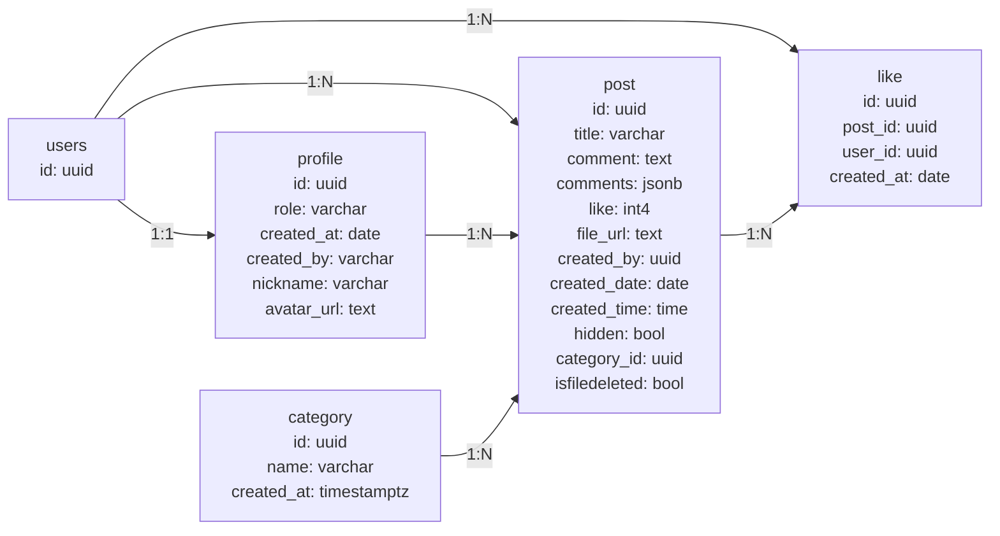

# ERD (Entity Relationship Diagram)

```mermaid
graph LR

  users[users<br/>id: uuid]

  profiles[profile<br/>id: uuid<br/>role: varchar<br/>created_at: date<br/>created_by: varchar<br/>nickname: varchar<br/>avatar_url: text]

  categories[category<br/>id: uuid<br/>name: varchar<br/>created_at: timestamptz]

  posts[post<br/>id: uuid<br/>title: varchar<br/>comment: text<br/>comments: jsonb<br/>like: int4<br/>file_url: text<br/>created_by: uuid<br/>created_date: date<br/>created_time: time<br/>hidden: bool<br/>category_id: uuid<br/>isfiledeleted: bool]

  likes[like<br/>id: uuid<br/>post_id: uuid<br/>user_id: uuid<br/>created_at: date]

  %% リレーション（表示順も工夫）
  users -->|1:1| profiles
  users -->|1:N| posts
  users -->|1:N| likes
  profiles -->|1:N| posts
  categories -->|1:N| posts
  posts -->|1:N| likes
```
